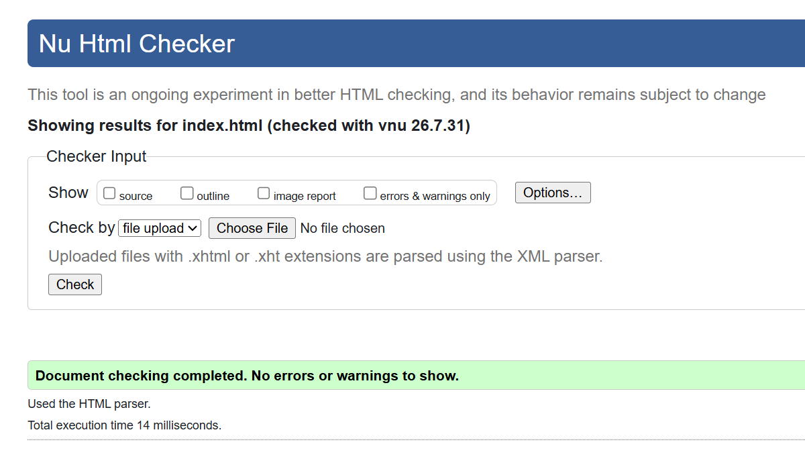
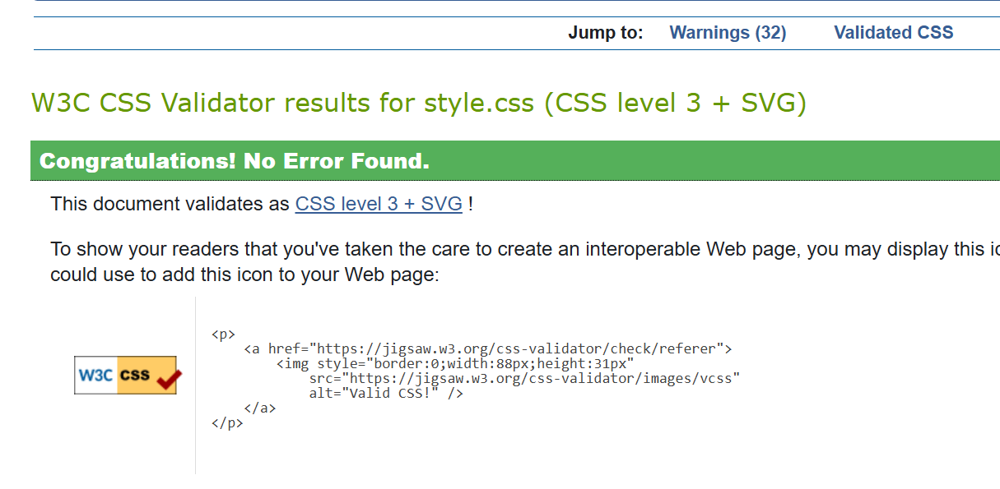

# hello world!

Built a personal portfolio as a part of Full Stack Development Course, NIT-W using only HTML and CSS.
The design approach was to have a 2000s desktop feel, with old windows and task bar boxes for a nostalgic feel :D

To run -> click index.html


## Files
```
index.html            webpage
style.css             stylesheet
assets/               my photo, favicon + the validator screenshots
responsive-views.pdf  the page at tablet + mobile sizes
README.md             this file!
```

## Design rationale

Wanted it to feel like an old Windows 2000 desktop -> every section is a "window", the nav is the taskbar, and the home screen has 5 shortcut boxes you click to open a section. Went with a brushed chrome background + a beveled "hello world!" title for a bit of Y2K :)

## Layout -> why grid vs flexbox

Tried to use whichever one actually fit the job:
- Grid -> for 2D stuff that sits in rows AND columns. the 5 desktop shortcuts (3 up top, 2 centered below), projects gallery, about (photo + text), contact (form + links).
- Flexbox -> for single rows / one direction. the taskbar, each window title bar, the skill chips that wrap, the factsheet rows (label + value).

short version: grid for the big layouts, flex for the little rows.

## Known limitations

- the contact form doesnt send anything yet, its just html/css (no backend).
- the chrome title relies on webkit background-clip; where it isn't supported, the title falls back to a plain slate colour.
- only really tested on chrome + edge.


## Validation

- W3C Nu HTML validator - 0 errors
- W3C CSS validator - 0 errors






## Usage of AI

Used AI tools for styling aspects:
1. "hello world" bevel, and gradient effect (learn about webkits)
2. Responsiveness for multi-media purpose (in mobile, tablet, laptop etc)
